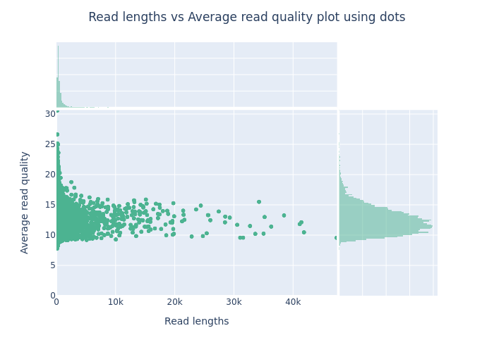
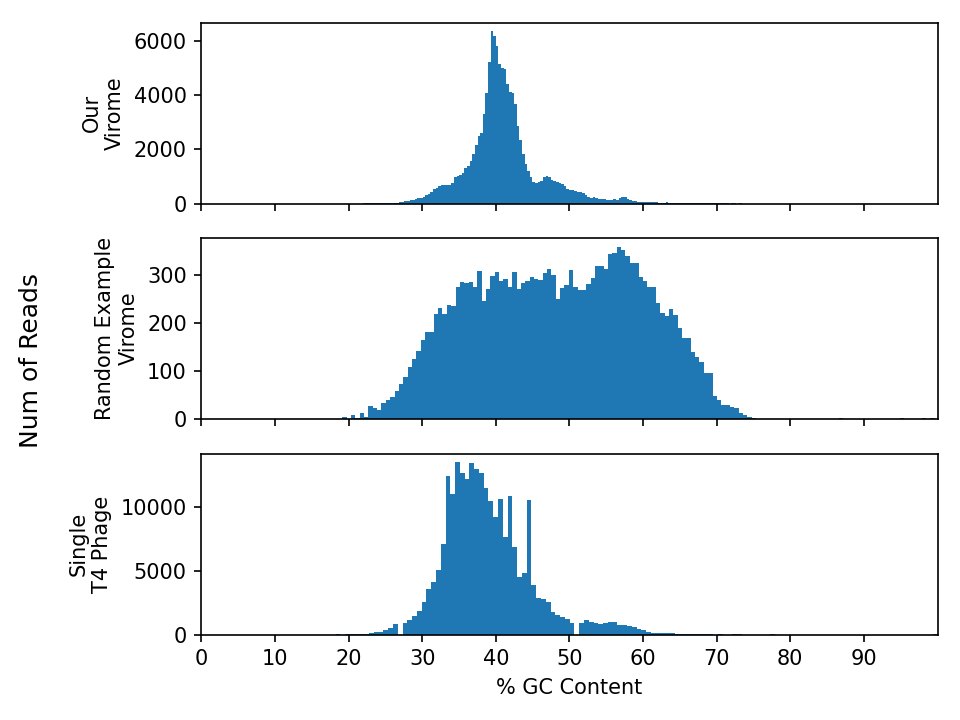


<p align="center">
    <a href="{{ site.carpentries_site }}"></a>
</p>

Every step of a metagenomics/viromics analysis pipeline needs quality control and sanity checks.  
- What data am I working with?
- What is the quality of the data or analysis?
- Are my results what I expected them to be? Why?/Why not?

Here, we will assess the quality of DNA sequencing. 

Sequencing quality control can include:
- Removing barcodes (i.e. oligonucleotides that were artificially added to identify sequences from a particular sample)
- Removing sequencing adapters (i.e. oligonucleotides that were artificially added to facilitate the sequencing process)
- Removing low-quality nucleotides (sequencing quality often drops towards the end of the reads)
- Filtering out reads based on quality scores (some reads are derived from faulty clusters or pores, and are best ignored)

To prepare your data, we used Nanopore basecaller [Dorado](https://github.com/nanoporetech/dorado) to do the basecalling and demultiplexing. This step also trims any adapters, primers and barcodes from the reads. 

> ## Exercise
>
> Discuss with your classmates and TAs:
> 
> {:start="1"}
> 1. Why do we need quality control?  
> 2. What are some metrics for assessing sequencing quality?  
> 3. What are the potential impacts of not performing quality control on your reads?
> 
> {: .source}
{: .challenge}

## Assessing Sequencing Quality

We will use [NanoPlot](https://github.com/wdecoster/NanoPlot?tab=readme-ov-file) to assess the quality of our reads. NanoPlot is designed for long reads and uses information in the sequence files to evaluate the quality of our reads. 

> ## Exercise
>
> Run NanoPlot on your reads
> - Assess the sequencing quality for each sample using default parameters
> - Use fastq files and summary.txt located `./data/sequences/` to generate diff types of quality plots (see the NanoPlot github)
> - Play around with the parameters such as colours and types of plots to generate
> 
>```bash
>
># to run nanoplot - you will need to source and activate the following conda environment:
>source /vast/groups/VEO/tools/anaconda3/etc/profile.d/conda.sh && conda activate nanoplot_v1.41.3
>
> NanoPlot -t ? --plots ? --color ? --fastq barcode1.fastq.gz -o output_dir/barcode1
>```
> 
> {: .source}
{: .challenge}

### Resources

[Information about Nanopore sequencing quality and Phred scores](https://help.nanoporetech.com/en/articles/6629615-where-can-i-find-out-more-about-quality-scores)

[An example sbatch script](https://github.com/vmkhot/Metagenome-workflows/blob/main/example_sbatch.md)

[How to write a for-loop to loop through your files](https://github.com/vmkhot/useful-scripts/blob/main/Linux%20Commands%20Cheat%20Sheet.md#loops)

> ## sbatch script for NanoPlot
> ```bash
> #!/bin/bash
> #SBATCH --tasks=1
> #SBATCH --cpus-per-task=10
> #SBATCH --partition=short,standard
> #SBATCH --mem=5G
> #SBATCH --time=2:00:00
> #SBATCH --job-name=sequencing_QC
> #SBATCH --output=10_nanoplot/nanoplot.slurm.out.%j
> #SBATCH --error=10_nanoplot/nanoplot.slurm.err.%j
> 
> # First, we check the quality of the reads using nanoplot
> # activate the conda environment containing nanoplot
> 
> source /vast/groups/VEO/tools/anaconda3/etc/profile.d/conda.sh && conda activate nanoplot_v1.41.3
> 
> datadir=../data/sequences
> outdir=./10_nanoplot
> 
> # Run nanoplot on 3 fastq files in a for loop
> # -t : threads (cpus)
> # --plots : types of plots to produce, see gallery: https://gigabaseorgigabyte.wordpress.com/2017/06/01/example-gallery-of-nanoplot/ 
> # --N50 : draw the N50 vertical line on the plots
> # --color : color for the plots
> # -o : output directory
> # to see other options for colors and prefilters, run : NanoPlot -h
> 
> for fn in $datadir/*.fastq.gz
> do
> base_f=$(basename $fn .fastq.gz)        # select just the first part of the name
> NanoPlot -t 10 --plots dot --N50 --color slateblue --fastq $fn -o $outdir/${base_f}/
> done
> 
>
>```
> {: .source}
{: .solution}

This is an example of a plot you might get from NanoPlot. It is important to look at such a plot to estimate how much data will be lost when you filter by read quality or length.
- The top plot shows frequency of read lengths
- The large main plot shows how the read quality changes by read length
- The right plot shows the frequency of read qualities




> ## Exercise
> 
> {:start="4"}
> 4. How does the sequencing quality of your virome compare with the above example image? Specify your answer with metrics from the NanoPlot results.
> 5. Do we need to remove any reads from our data? Why (not)? 
> 6. What does Q12 mean? How much data will be lost from each sample if we filter at Q12? (Hint: check the Nanoplot outputs)
> 
> {: .source}
{: .challenge}

## Filtering Reads

Many phages naturally have [low-complexity regions](https://en.wikipedia.org/wiki/Low_complexity_regions_in_proteins) in their genomes (e.g. ACACACACAC). Nanopore sequencing errors are biased towards low-complexity regions, either by falsely generating them or by exacerbating them. This can create artefacts in the assembled viral genome sequences. High-quality reads can significantly improve assemblies, particularly for error-prone long reads. 

> ## Exercise - filter your reads
>
> We will use [Chopper](https://github.com/wdecoster/chopper) to filter our reads based on quality scores and length. In our case, a lot of reads are high quality, therefore to reduce the amount of data we process downstreamm, we will use a phred score threshold of 24. Build an sbatch script for chopper based on the following basic usage example. Use the following filtering criteria:
> - minimum quality 24
> - minimum length 1000 bp
> - maximum length 40000 bp
>
>```bash
># activate the conda environment
> source /vast/groups/VEO/tools/anaconda3/etc/profile.d/conda.sh && conda activate chopper_v0.5.0
> 
># base usage for filtering with minimum quality 24
> gunzip -c reads.fastq.gz | chopper -q 24| gzip > filtered_reads.fastq.gz
>
># check the help for the other options
>chopper -h
>```
>
>{: .source}
{: .challenge}


>## Chopper sbatch script
>```bash
> #!/bin/bash
> #SBATCH --tasks=1
> #SBATCH --cpus-per-task=10
> #SBATCH --partition=short,standard
> #SBATCH --mem=1G
> #SBATCH --time=2:00:00
> #SBATCH --job-name=sequencing_QC
> #SBATCH --output=20_chopper/chopper.slurm.out.%j
> #SBATCH --error=20_chopper/chopper.slurm.err.%j
> 
> # activate the conda environment containing chopper
> 
> source /vast/groups/VEO/tools/anaconda3/etc/profile.d/conda.sh && conda activate chopper_v0.5.0
> 
> datadir="../data/sequences"
> outdir="20_chopper"
> 
> # gunzip : unzip the reads
> # -q : minimum read quality to keep
> # -l : minimum read length to keep
> # gzip: rezip the filtered reads
> 
> for fn in ../data/sequences/*.fastq.gz
> do
> 
> base_f=$(basename $fn .fastq.gz)        # select just the first part of the name
> gunzip -c $fn | chopper -q 24 -l 1000 --maxlength 40000 | gzip -2 > $outdir/${base_f}_filtered_reads.fastq.gz
> 
> done
>```
>{: .source}
{: .solution}


> ## Exercise
> 
> {:start="7"}
> 7. How many reads do you have left after filtering? What percentage of the original reads were filtered?
> 8. What is the average quality before and after filtering?
> 9.  *Optional: Run Nanoplot again to show the difference in the read statistics*
>{: .source}
{: .challenge}

## GC Content
GC Content ((sum of all **G**'s + **C**'s) / (sum of all **T**'s + **A**'s)) is another interesting metric to evaluate your sequencing data. There's no "wrong" GC content, rather this measure tells us something about the nucleic acid diversity our metagenomes/viromes. GC content is generally consistent along the length of a genome, as the GC content of sequencing reads from a single genome follows a bell curve. Regions with outlier values often represent non-self regions, for example a horizontally transferred gene, an inserted prophage, or a mobile genetic element. GC content is generally consistent for genomes of similar strains. 

Below are three GC plots - Our virome, another random virome + a single [E. coli phage T4](https://trace.ncbi.nlm.nih.gov/Traces/?view=run_browser&acc=SRR29341083&display=metadata) phage genome. Please use this plot to answer the following questions. 



>## Exercise - GC content plots
>
> Interpret the distributions:
>
> {:start="10"}
> 10. Are these histograms what you expected? why/why not?
> 11. How would the GC content of a **metagenome** differ from these viromes?  
> 12. Describe the difference in GC content between the viromes and [E. coli phage T4](https://trace.ncbi.nlm.nih.gov/Traces/?view=run_browser&acc=SRR29341083&display=metadata).  
> - For example: What interpretations can you make about the samples based on these plots?  
>{: .source}
{: .challenge}

Below is the python script used to make these plots for your reference and future use. 

>## python script to make GC_content plots
> To install the libraries
>```bash
> source ./py3env/bin/activate
> pip install biopython, pandas, numpy, matplotlib
>```
>
>```python
>#! usr/bin/python3
>
># import libraries into your script
>from Bio.SeqUtils import gc_fraction
>from Bio import SeqIO
>import pandas as pd
>import numpy as np
>import gzip, sys
>import matplotlib.pyplot as plt
>
>file1=sys.argv[1]
>file2=sys.argv[2]
>T4_path=sys.argv[3]
>
># read in fastq.gz files 
>gc_62={}
>with gzip.open(file1, 'rt') as f:
>   for record in SeqIO.parse(f, "fastq"):
>       gc_62[record.id]=gc_fraction(record.seq)*100
>
>print("file1... done")
>
>gc_63={}
>with gzip.open(file2, 'rt') as f:
>   for record in SeqIO.parse(f, "fastq"):
>       gc_63[record.id]=gc_fraction(record.seq)*100
>print("file2... done")
>
>gc_T4={}
>with gzip.open(T4_path, 'rt') as f:
>   for record in SeqIO.parse(f, "fastq"):
>       gc_T4[record.id]=gc_fraction(record.seq)*100
>       #print(gc_fraction(record.seq)*100)
>print("gc_T4... done")
>
># convert to a pandas dataframe
># For your samples
>df_62 = pd.DataFrame([gc_62])
>df_62 = df_62.T
>df_63 = pd.DataFrame([gc_63])
>df_63 = df_63.T
>
># For T4 phage
>df_T4 = pd.DataFrame([gc_T4])
>df_T4 = df_T4.T
>
># make a plotting function
>def make_plot(axs):
>   # We can set the number of bins with the *bins* keyword argument.
>   n_bins = 150
>
>   ax1 = axs[0]
>   ax1.hist(df_62, bins=n_bins)
>   ax1.set_ylabel('Our\nVirome', fontsize=10)
>   ax1.set_xlim(0, 100)
>   ax1.set_xticks(np.arange(0, 100, step=10))
>
>   ax2 = axs[1]
>   ax2.hist(df_63, bins=n_bins)
>   ax2.set_ylabel('Random Example\nVirome',fontsize=10)
>
>   ax4 = axs[2]
>   ax4.hist(df_T4, bins=n_bins)
>   ax4.set_ylabel('Single\nT4 Phage',fontsize=10)
>   ax4.set_xlabel('% GC Content', fontsize=10)
>
># Plot:
>fig, axs = plt.subplots(3,1, sharex=True, tight_layout=True)
>make_plot(axs)
>fig.supylabel('Num of Reads')
>plt.show()
>
># save your plot
>fig.savefig('GC_Content.png', dpi=150)
>```
>{: .source}
{: .solution}

