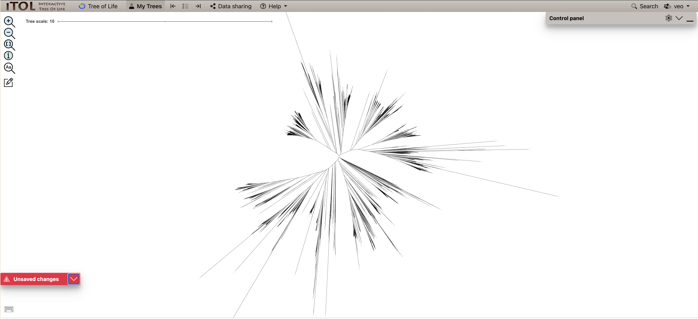

## What kind of phages exist in your dataset?

For this task, we will first build a phylogenetic tree using the terL marker gene.

### TerL phylogenetic tree

The terminase large subunit is a widely used marker gene for phages. This protein packages the DNA into an empty pro-capsid. It has two parts: 1) an ATP driven motor for viral DNA translocation and 2) a endonuclease to cleave the viral DNA to signal the end of the packaging reaction, once the capsid is full.  TerL is quite essential in the assembly of full _icosahedral_ capsids, and therefore makes a good marker gene for the _Caudoviricetes_ order. Consider also that some phages do not require, and therefore, do not encode a terL gene.

#### Basics of making a tree
1. Start with amino acid sequences in a fasta file
2. Make a multiple sequence alignment (MSA) - _this identifies biologically informative positions for tree inference_
3. **INSPECT** your MSA - _you might need to trim poorly aligned columns_
4. Build a tree - _there are several tree building algorithms - we will use maximum likelihood_

> ## Exercise - Make a terL phylogenetic tree with your sequences
>
> For this exercise, we will use the [ICTV reference phages](https://ictv.global/vmr). We have extracted the terL amino acid sequences from the ICTV reference phages using pharokka, and pre-built a multiple sequence alignment. You will have to add your sequences to this alignment using [mafft](https://mafft.cbrc.jp/alignment/server/add.html) and then trim the alignments using [trimAl](https://vicfero.github.io/trimal/) and build a tree using [FastTree 2](https://morgannprice.github.io/fasttree/). The solution sbatch script at the bottom of the tree-making section includes all the tree-making steps.
> 
> To get a fasta file of your terL amino acid sequences (output by Pharokka) and locate the pre-built MSA
>
> ```bash
> # location of the terL sequences from pharokka output
> ./1.4_annotation/10_pharokka/terL.faa
> 
> # location of the reference pre-built MSA
> /vast/groups/VEO/shared_data/Viromics2025_workspace/data/alignments/terL_ICTV_ref_phage_alignment.fasta
>
># copy the terL alignment to your own directory
> mkdir -p viromics/data/alignments   # make a directory if it doesn't exist
> cp /vast/groups/VEO/shared_data/Viromics2025_workspace/data/alignments/terL_ICTV_ref_phage_alignment.fasta viromics/data/alignments
> ```
> 
> To add your terL sequences to the reference alignment using mafft. You need the following command and it will take ~22min
>
> ```bash
> /home/groups/VEO/tools/mafft/v7.505/bin/mafft --reorder --keeplength --addfragments contigs_terL.fasta  reference_alignment.fasta >  new_MSA.fasta
> ```
>
> To trim your alignment using TrimAl (-gappyout)
> 
> ```bash
> trimal -in new_MSA.fasta -out new_MSA_trimmed.fasta -gappyout
> ```
> 
> To build a tree using FastTree.
> 
> ```bash
> /home/groups/VEO/tools/fastTreeMP/v2.1.11/FastTreeMP -lg -pseudo < new_MSA_trimmed.fasta > new_MSA_trimmed.tree
> 
> # -lg : Uses the LG model. Note: the LG model is an updated model that describes how likely it is that one amino acid is replaced by another based on patterns found in real protein families. The default model for Fasttree is the JTT - which is older but similar model.
> # -pseudo : Adds pseudo counts (for gappy alignments)
> ```
>{: .source}
{: .challenge}

### TerL tree outputs

Phylogenetic trees come in several output types but here the above commands produce a tree in a *newick* format. This is a text file and you can open it with any text editor to see what it looks like. It takes the shape: `(A:0.1, B:0.2, (C:0.3, D:0.4)E:0.5)F;`

#### The final terL tree might look something like this:


This `.tree` file _can_ be opened with dendroscope (if you downloaded it locally) or [iTOL](https://itol.embl.de/) or another tree-visualization software **HOWEVER** the full terL tree we will produce will have 5000+ leaves, which will be difficult to load into tree-viewers and might crash your computer when trying to find your viruses. 

Instead, you could post-process the tree using the `ete3` library in Python. 

> ## Exercise -  Post-process large tree --> smaller tree
> 
> There are a few ways to post-process trees to make them viewable or to highlight our viruses of interest.
> 
> - One way would be build a script that takes the input of a single contig and the tree file and pruning the tree around the contig to a certain number of the closest reference viruses. Pruning a tree means only certain clades or leaves are left.  
> - Instead of pruning, you can also "collapse" clades to make the tree manageable to view. For this, clades are collapsed into a single leaf that replaces them. In very large trees, you will probably encounter large clades that are far away from your sequences of interest that can be collapsed and replace. For this, you might want to give an input of all your viruses of interest. 
>
>{: .source}
{: .challenge}

We've built two python scripts using this library to shrink the size of tree outputs. The locations of the tree-pruning scripts will be in your python_scripts directory `python_scripts/1.5_collapse_non_target_clades.py` and `python_scripts/1.5_trim_tree_to_500_neighbors.py`.  

`1.5_trim_tree_to_500_neighbors.py` will trim your tree around a contig of your choice to the closest 500 neighbours. `1.5_collapse_non_target_clades.py` will collapse clades that don't contain viruses from our dataset. These scripts also include a section to generate ITOL annotation files. 

> ## python script to trim tree around 1 contig
>```python
># trim_tree_to_500_neighbors.py
>
>from ete3 import Tree
>import sys
>
>def trim_tree(input_tree_file, target_leaf_name, output_tree_file, itol_output_file=None, num_neighbors=500):
>    tree = Tree(input_tree_file, format=1)
>
>    if not tree.search_nodes(name=target_leaf_name):
>        raise ValueError(f"Leaf '{target_leaf_name}' not found in the tree.")
>
>    target_leaf = tree&target_leaf_name
>    leaves = [(leaf, target_leaf.get_distance(leaf)) for leaf in tree.iter_leaves()]
>    leaves.sort(key=lambda x: x[1])
>
>    # Get ~500 closest neighbors including the target leaf
>    closest_leaves = set([leaf.name for leaf, dist in leaves[:num_neighbors]])
>
>    # Prune the tree
>    pruned_tree = tree.copy()
>    pruned_tree.prune(closest_leaves, preserve_branch_length=True)
>    pruned_tree.write(outfile=output_tree_file, format=1)
>
>    if itol_output_file:
>        user_colour = "#079907"       # Green for user nodes  
>        with open(itol_output_file, "w") as f:
>            f.write("DATASET_SYMBOL\n")
>            f.write("SEPARATOR TAB\n")
>            f.write("DATASET_LABEL\tUser-selected leaves\n")
>            f.write("COLOR\t#00cc00\n")
>            f.write("DATA\n")
>            f.write(f"{target_leaf_name}\t3\t2\t{user_colour}\t1\t1\n")      # symbol star=3, size=2, fill=1,position=1
>
>if __name__ == "__main__":
>    if len(sys.argv) not in (4, 5):
>        print("Usage: python trim_tree_to_500_neighbors.py input_tree.nwk target_leaf_name output_tree.nwk [itol_output.txt]")
>        sys.exit(1)
>    itol_output = sys.argv[4] if len(sys.argv) == 5 else None
>    trim_tree(sys.argv[1], sys.argv[2], sys.argv[3], itol_output)
>```
>{: .source}
{: .solution}


> ## python script to collapse clades except our viruses
>```python
># collapse_non_target_clades.py
>
>from ete3 import Tree
>import sys
>
>def collapse_large_non_target_clades(input_tree_file, user_leaves_file, output_tree_file, itol_output_file=None, threshold=100):
>    tree = Tree(input_tree_file, format=1)
>
>    with open(user_leaves_file) as f:
>        target_leaves = set(line.strip() for line in f if line.strip())
>
>    collapsed_info = []
>    node_counter = [1]
>
>    def process_node(node):
>        leaves_in_subtree = set(leaf.name for leaf in node.iter_leaves())
>        if len(leaves_in_subtree) > threshold and not (leaves_in_subtree & target_leaves):
>            collapsed_name = f"collapsed_node_{node_counter[0]}"
>            node.name = collapsed_name
>            node_counter[0] += 1
>            collapsed_info.append((collapsed_name, len(leaves_in_subtree)))
>            node.children = []
>        else:
>            for child in node.children:
>                process_node(child)
>
>    process_node(tree)
>
>    tree.write(outfile=output_tree_file, format=1)
>
>    if itol_output_file:
>        # collapsed_colour = "#878787"  # Blue for collapsed nodes
>        user_colour = "#079907"       # Green for user nodes  
>
>        # with open(itol_output_file, "w") as f:
>        #     f.write("DATASET_TEXT\n")
>        #     f.write("SEPARATOR TAB\n")
>        #     f.write("DATASET_LABEL\tCollapsed Nodes\n")
>        #     f.write(f"COLOR\t{collapsed_colour}\n")
>        #     f.write("DATA\n")
>        #     for node_name, size in collapsed_info:
>        #         if not node_name:
>        #             continue  # Skip blank node names just in case
>        #         f.write(f"{node_name}\t{collapsed_colour}\tClade ({size} leaves)\n")
>
>        # Write user leaf highlight using green stars (iTOL DATASET_SYMBOL)
>        # highlight_file = itol_output_file.replace(".txt", "_user_symbols.txt")
>        with open(itol_output_file, "w") as f:
>            f.write("DATASET_SYMBOL\n")
>            f.write("SEPARATOR TAB\n")
>            f.write("DATASET_LABEL\tUser-selected leaves\n")
>            f.write("COLOR\t#00cc00\n")
>            f.write("DATA\n")
>            for leaf in sorted(target_leaves):
>                f.write(f"{leaf}\t3\t2\t{user_colour}\t1\t1\n")      # symbol star=3, size=2, fill=1,position=1
>
>if __name__ == "__main__":
>    if len(sys.argv) not in (4, 5):
>        print("Usage: python collapse_non_target_clades.py input_tree.nwk user_leaves.txt output_tree.nwk [itol_output.txt]")
>        sys.exit(1)
>    itol_output = sys.argv[4] if len(sys.argv) == 5 else None
>    collapse_large_non_target_clades(sys.argv[1], sys.argv[2], sys.argv[3], itol_output)
>```
>{: .source}
{: .solution}


> ## Exercise - Post-process your tree
>
> Use the below sbatch script make your tree and post-process it. **Note:** For some exercises today, pick a pet contig (maybe the same as the one yesterday!). You will have change the contig name in the sbatch scripts accordingly. 
>
> Please pause once you have made the trees! We will visualize the tree together with a demo in itol **so that you can make nice graphics to include in your lab books**! 
>
> {: .source}
{: .challenge}

> ## sbatch script to make tree and post-process it
> ```bash
>#!/bin/bash
>#SBATCH --tasks=1
>#SBATCH --cpus-per-task=10
>#SBATCH --partition=short,standard,interactive
>#SBATCH --mem=50G
>#SBATCH --time=2:00:00
>#SBATCH --job-name=terL_tree
>#SBATCH --output=./10_terL_tree/terL.slurm.%j.out
>#SBATCH --error=./10_terL_tree/terL.slurm.%j.err
>
># Run mafft to add the sequences
>mafft="/home/groups/VEO/tools/mafft/v7.505/bin/mafft"
>new_seqs="../1.4_gene_annotation/10_pharokka/results/terL.faa"
>terl_aln="../data/alignments/phylogenetic_alignments/terL_ICTV_ref_phage_alignment.fasta"
>
># have to add sequences to untrimmed alignment, since mafft doesn't know what was trimmed
>$mafft --add $new_seqs --reorder $terl_aln > ./10_terL_tree/terL_MSA.fasta
>
># Trim the alignment using trimAl
>trimal="/home/groups/VEO/tools/trimal/v1.5.0/trimal/source/trimal"
>$trimal -in ./10_terL_tree/terL_MSA.fasta -out ./10_terL_tree/terL_MSA_trimmed.fasta -gappyout
>
># Build a tree using fasttree
>fastTreeMP="/home/groups/VEO/tools/fastTreeMP/v2.1.11/FastTreeMP"
>$fastTreeMP -lg -pseudo < ./10_terL_tree/terL_MSA_trimmed.fasta > ./10_terL_tree/terL_MSA_trimmed.tree
>
>source ../py3env/bin/activate
>
># change your contig name here
>contig_name=contig_71_CDS_0091
>
># prune the tree based on your selected contig
>python3 ../python_scripts/1.5_trim_tree_to_500_neighbors.py ./10_terL_tree/terL_MSA_trimmed.tree $contig_name ./10_terL_tree/terl_${contig_name}_pruned.tree ./10_terL_tree/${contig_name}_itol_annotation.txt
>
># get all your viruses into user_leaves.txt
>grep ">" ../1.4_gene_annotation/10_pharokka/results/terL.faa | sed 's/>//g' |sed 's/ .*$//' > ./10_terL_tree/user_leaves.txt
>
># collapse tree branches except user defined leaves
>python3 ../python_scripts/1.5_collapse_non_target_clades.py ./10_terL_tree/terL_MSA_trimmed.tree ./10_terL_tree/user_leaves.txt ./10_terL_tree/terl_collapsed.tree ./10_terL_tree/collapsed_itol_annotation.txt
>
>deactivate
>```
>{: .source}
{: .solution}

> ## Exercise - comparing your taxonomic annotations
> 
>{:start='4'} 
>4. What is the taxonomy classification of your *pet contig* from the terL tree? (if at all)
>
> ### Group Discussions
> 
>{:start='7'}
>7. Explore the terL tree together - include a graphic of at least 1 tree
>8. What do long branches on your terL tree mean?
>9. What does a rooted versus an unrooted tree represent?
>10. What are the limitations of using the terL tree? and could you overcome these limitations?
> 
> {: .source}
{: .challenge}

> ## Hint on querying pickle files using python
>```python
> import pandas as pd
> 
> # read in the shared genes pickle file
> # this pickle file contains genes shared at even 30% identity - there are other files for 40, 50 ,60 and 70% identity
>df_3 = pd.read_pickle("HMMprofile.0.3_SqRoot_shared_genes.pkl.gz")
>df_3
># check how many genes contig_518 shares with the other contigs
>df_3_contig_518 = df_3.loc[df_3['contig_518'] > 0, 'contig_518']
>df_3_contig_518
> ```
> {: .source}
{: .solution}
