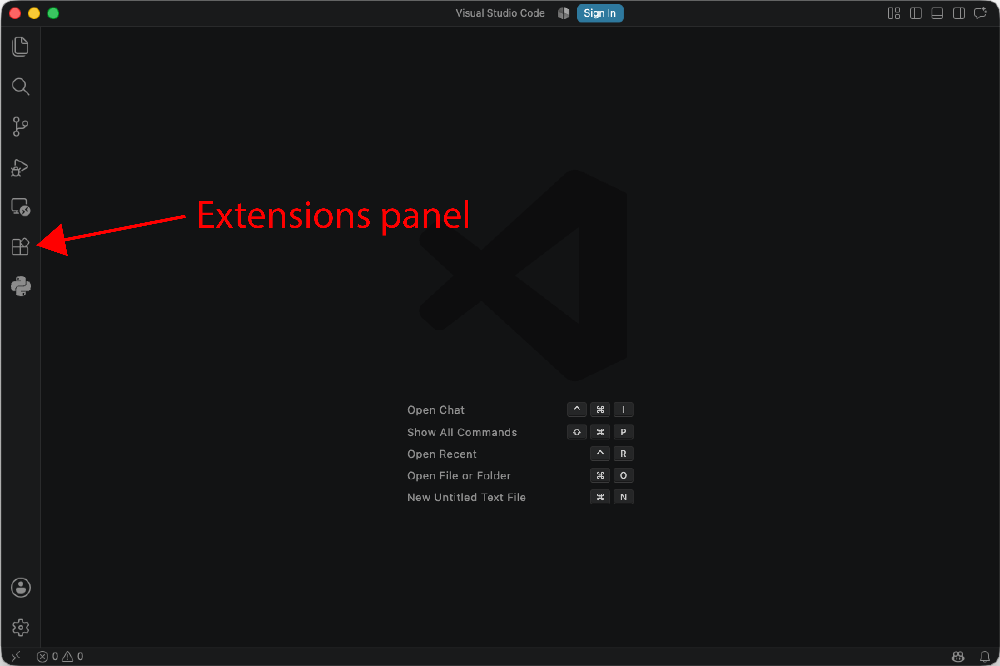
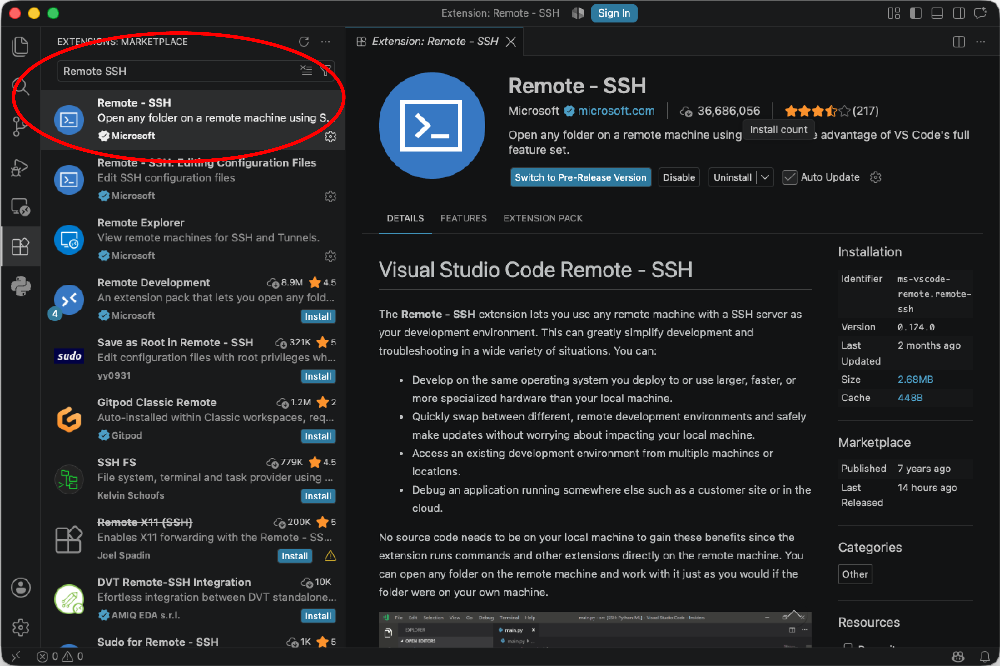

### What you need to do before the course
Before the course starts, please complete the steps below. This will make sure that you can connect to Draco, the high-performance computing (HPC) cluster at the University of Jena, when the course begins.

You will need:

- your laptop;
- your URZ username and password;
- an internet connection.

Please complete all steps **before the first day of the course**. If you have trouble connecting to Draco, contact the course instructors before the course starts so that we can help you troubleshoot the problem.

## 1. Install and connect to University VPN

Install a VPN following [these instructions](https://www.uni-jena.de/12965/vpn-softwaredownload-und-installation). Log in using your URZ credentials and make sure that you can successfully connect to the VPN. 

>>**Important:** You need to be connected to the University VPN when accessing Draco from outside the University network.

## 2. Install VS Code

Download and install [Visual Studio Code](https://code.visualstudio.com/) for your operating system.

## 3. Install the Remote SSH - extension

1. Open VS Code and select the **Extensions** panel.

2. Search for **Remote - SSH**, published by Microsoft, and install it:

You will use this extension throughout the course to work with files and run commands on Draco.

## 4. Connect to Draco
Make sure that your **University VPN is connected** before continuing.

1. Open VS Code

2. Open the Command Palette in VS Code by pressing **command+shift+p** on macOS or **ctrl+shift+p** on Windows or Linux. 

3. Select **Remote-SSH: Connect to Host...**

4. Alternatively, you can press the button in the lower left corner:

5. Login using your FSU id ad Draco host (login1.draco.uni-jena.de or login2.draco-uni-jena.de) and press enter:

6. Enter your URZ password when prompted.

If the connection is succesful, VS Code will show that you are connected to a remote host in the lower left corner (in this case login2.draco.uni-jena.de). 

7. Check that you can access Draco. 
Open a terminal in VS Code using **Terminal -> new window** or open the windown in the lower right corner. 
Run: 
hostname. 
This should return the hostname of the Draco login node to which you are connected (either 'login1.cluster' or login2.cluster'). 

Then run: 
pwd
this should show your home directory on Draco.

**That's it!** You do not need to learn any Bash commands before the course. We will introduce the terminal and the commands you need during the course.
